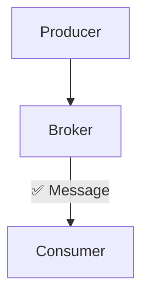
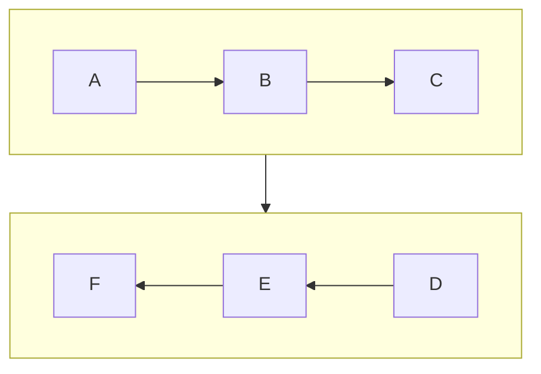
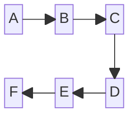

import Admonition from "@theme/Admonition";

# Модуль 1. Основы брокеров

## Базовые понятия

Поставщик (Producer) - сервис, передающий сообщения в брокер.

<Admonition icon="Поставщик (Producer)" title="" type="note">
  Сервис, передающий сообщения в брокер.
</Admonition>

<Admonition icon="Сообщение (Messages)" title="" type="note">
  Данные, которые продьюсер отправляет, а консьюмер позже забирает и
  обрабатывает.
</Admonition>

<Admonition icon="Брокер сообщений (Broker)" title="" type="note">
  Промежуточный софт, реализующий логику отправки и получения сообщений от
  внешних сервисов.
</Admonition>

<Admonition icon="Потребитель (consumer)" title="" type="note">
  Сервис, получающий сообщение из брокера.
</Admonition>

import simpleGraph from "!!raw-loader!./test.drawio";
import Drawio from "@theme/Drawio";

<Drawio content={simpleGraph} />
