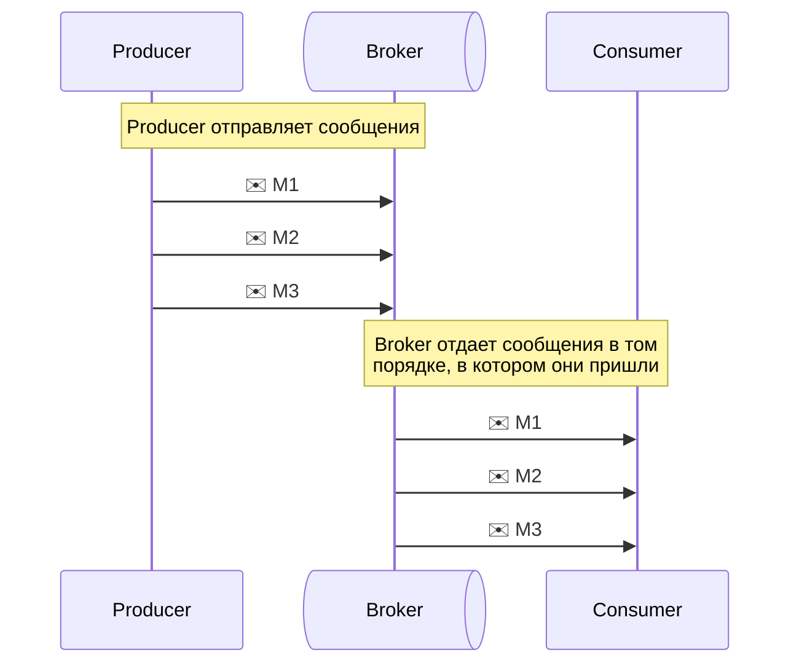
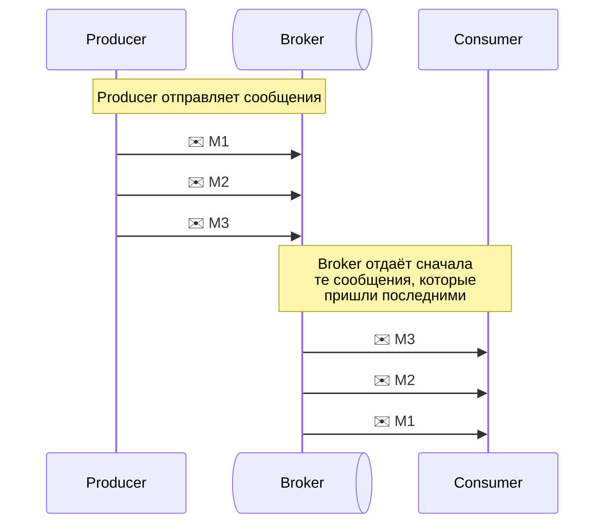

import BorderBox from "@site/src/components/BorderBox";
import Admonition from "@theme/Admonition";

# Модуль 1. Основы брокеров

## Базовые понятия

<BorderBox>
  ```mermaid
graph LR;
  Producer --> |Message| Broker;
  Broker --> |Message| Consumer;
```
</BorderBox>

<Admonition icon="Поставщик (Producer)" title="" type="note">
  Сервис, передающий сообщения в брокер.
</Admonition>

<Admonition icon="Сообщение (Messages)" title="" type="note">
  Данные, которые продьюсер отправляет, а консьюмер позже забирает и
  обрабатывает.
</Admonition>

<Admonition icon="Брокер сообщений (Broker)" title="" type="note">
  Промежуточный софт, реализующий логику отправки и получения сообщений от
  внешних сервисов.
</Admonition>

<Admonition icon="Потребитель (consumer)" title="" type="note">
  Сервис, получающий сообщение из брокера.
</Admonition>

## Условия поставки

<Admonition icon="Условие поставки" title="" type="note">
  Порядок, в котором сообщения попадают и извлекаются из очереди.
</Admonition>

Вот основные виды условий поставки:

### FIFO

<Admonition
  icon="FIFO (First In — First Out)"
  title=""
  type="note"
>

- **Первым пришел, первым ушел**. Сообщения обрабатываются в том порядке, в котором они попали в очередь.
- **Пример**. Пусть продьюсер отправил в очередь сначала сообщение M1, потом M2, потом M3. Консьюмер в таком случае получит их в том же порядке: сначала M1, потом M2, затем M3.
- **Где встречается**: обработка заказов, финансовые операции, последовательные изменения состояния.

</Admonition>

<BorderBox>



</BorderBox>

### LIFO

<Admonition
  icon="LIFO (Last In — First Out)"
  title=""
  type="note"
>

- **Последним пришёл, первым ушёл**. Какое сообщение пришло последним, то и обрабатывается в первую очередь.
- **Пример**. Пусть продьюсер отправил в очередь сначала сообщение M1, потом M2, потом M3. Консьюмер в таком случае получит их в обратном порядке: сначала M3, потом M2, затем M1.
- **Где встречается**: обработка задач с приоритетом «самое свежее важнее»: например, отмена предыдущих действий или интерактивные сценарии, где актуальность важнее хронологии.

</Admonition>

<Admonition
  icon=""
  title=""
  type="note"
>
LIFO встречается редко в брокерах сообщений.
И обычно реализуется не как базовое свойство очереди, а как частный приём на уровне логики обработки

</Admonition>

<BorderBox>



</BorderBox>

## Модели потребления

<table border="1" cellpadding="8" cellspacing="0">
  <thead>
    <tr>
      <th style={{ width: "10%" }}></th>
      <th style={{ width: "33%" }}>Один потребитель</th>
      <th style={{ width: "33%" }}>Множество потребителей</th>
    </tr>
  </thead>
  <tbody>
    <tr>
      <td>
        <strong>Удаление при чтении</strong>
      </td>
      <td>Queue (классический брокер)</td>
      <td>Pub-Sub (классический брокер)</td>
    </tr>
    <tr>
      <td>
        <strong>Не удаляются при чтении</strong>
      </td>
      <td style={{ backgroundColor: "#FF000015" }}>
        Модель с одним потребителем и чтением без удаления практически не
        используется. Как правило применяют Log
      </td>
      <td>Log (Kafka)</td>
    </tr>
  </tbody>
</table>
