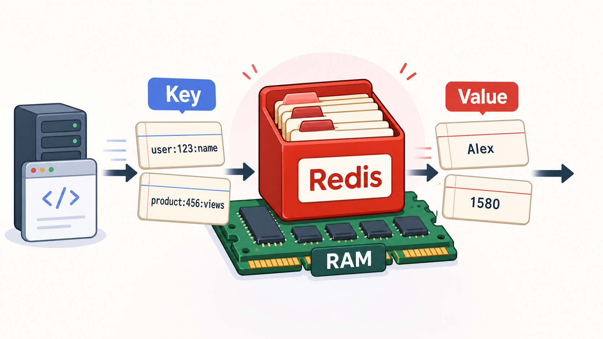
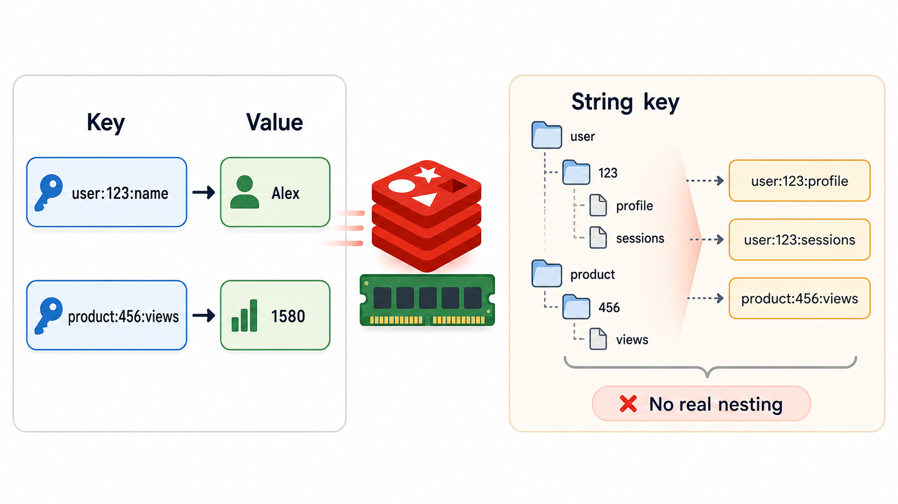
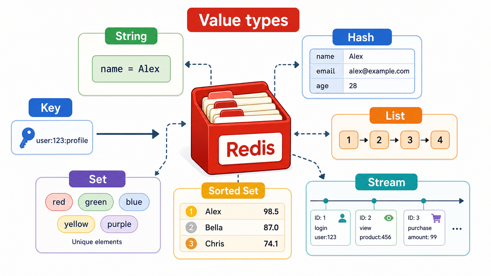
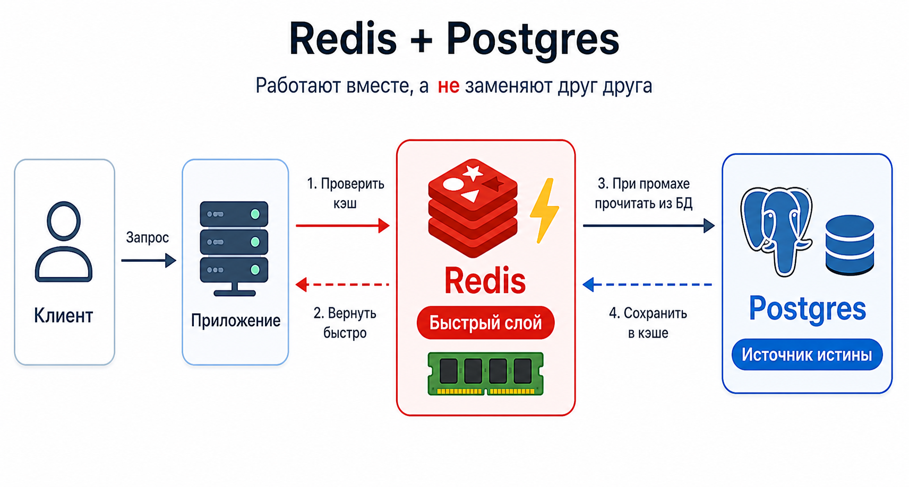
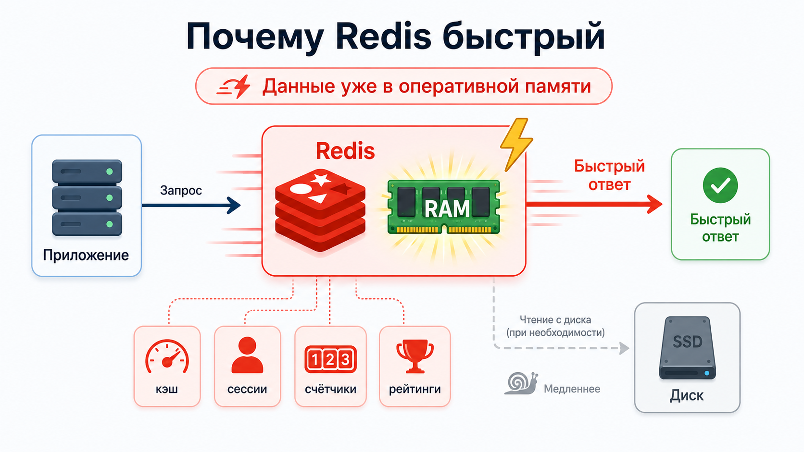
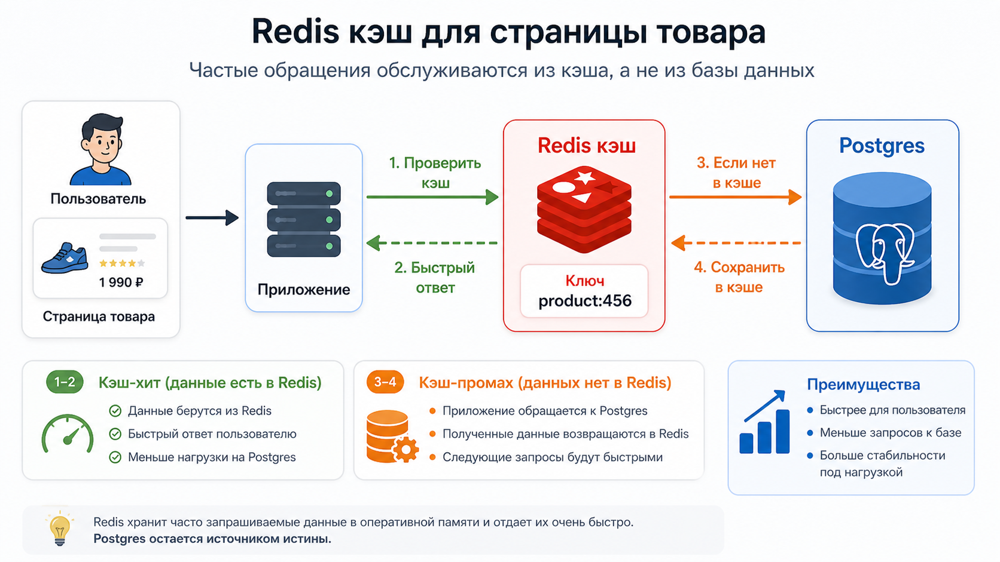
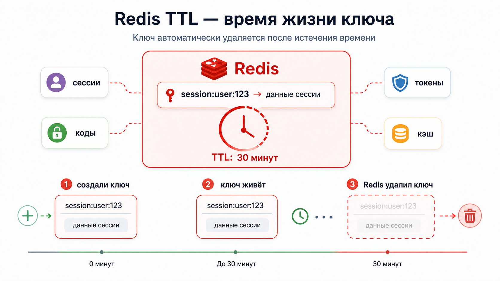
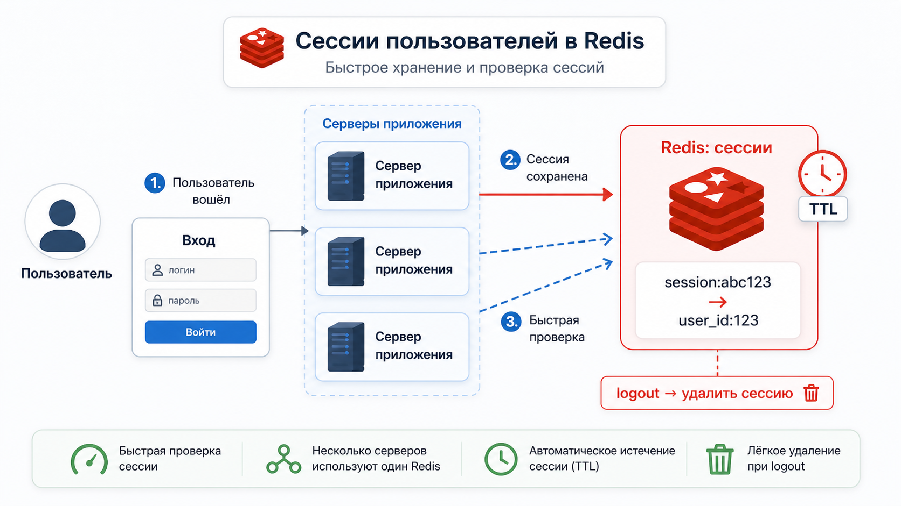
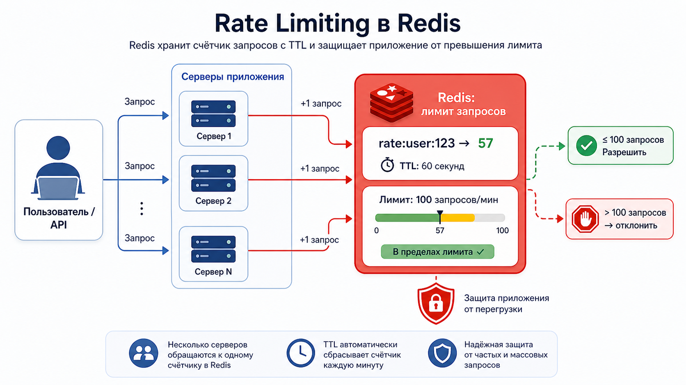
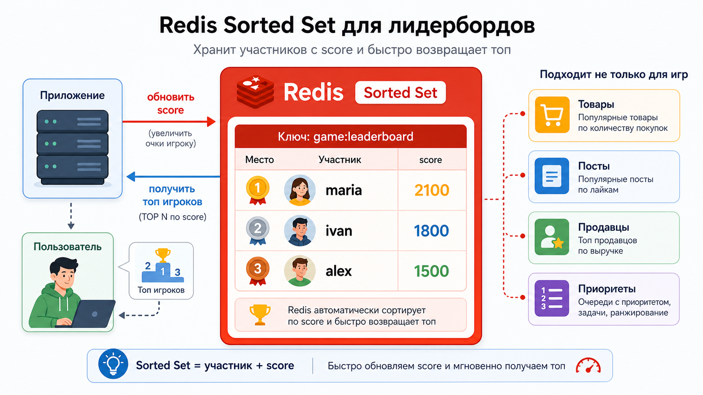

# Кратко про Redis



:::note

Redis — это **key-value база данных**, работающая в оперативной памяти.

:::

Если сильно упростить, Redis можно представить как очень быстрый словарь.

- В обычном словаре мы ищем значение по слову.
- В Redis приложение ищет данные по ключу.
- Мы сохраняем данные под конкретным ключом, а потом быстро забираем их по этому же ключу.

```text
ключ -> значение

user:123:name -> "Alex"
product:456:views -> 1580
```

## Базовая модель работы

**В Redis всё построено на работе с парами ключ-значение**.

- **Ключ** — это имя, по которому Redis находит данные. Его можно представить как адрес или ярлык.
- **Значение** — это сами данные, которые лежат по этому ключу.

Например:

```text
user:123:name -> "Alex"
product:456:views -> 1580
```

В этом примере:

- ключи — `user:123:name` и `product:456:views`;
- значения — `"Alex"` и `1580`.



**Ключом чаще всего выступает строка**. Для читаемости такие строки часто делят двоеточиями, создавая ощущение вложенности:

```text
user:123:profile
user:123:sessions
product:456:views
```

**Но для самого Redis никакой вложенности нет**. Ключ — это просто строка.

**Двоеточия нужны для удобства чтения**. Так проще работать с ключами и понимать, к какой части приложения они относятся.

## Какие значения можно хранить

Redis интересен не только тем, что он хранит данные по ключу, но и тем, что значением могут быть разные структуры данных.



Например:

| Структура  | Пример                         | Где может пригодиться                        |
| ---------- | ------------------------------ | -------------------------------------------- |
| String     | `user:123:name = "Alex"`       | Простые значения, токены, флаги              |
| Hash       | `user:123 -> name, email, age` | Небольшие объекты                            |
| List       | `notifications:user:123`       | Очереди, последние сообщения, списки событий |
| Set        | `post:777:unique_ips`          | Уникальные значения                          |
| Sorted Set | `game:leaderboard`             | Рейтинги, топы, очереди с приоритетом        |
| Stream     | `events:payments`              | Поток событий                                |

То есть Redis — это не просто "строка по ключу". Это набор быстрых структур данных, которые удобно использовать для разных задач.

## Redis + Postgres



Не стоит думать о Redis как о "быстрой замене Postgres".

Обычно Redis используют не вместо основной базы данных, а вместе с ней.

Postgres хранит основные данные:

- пользователей;
- заказы;
- платежи;
- историю операций;
- сложные связи между сущностями.

Redis хранит информацию, которую нужно получить очень быстро:

- кэш;
- временные сессии;
- счётчики;
- ограничения запросов;
- состояние простых real-time сценариев.

Postgres отвечает за надёжность и сложные отношения между данными.  
Redis отвечает за скорость и быстрый доступ к простым данным.

## Почему Redis быстрый



:::note

Redis написан на C и работает в оперативной памяти, что делает его невероятно быстрым.

:::

Когда приложению нужно получить данные из Redis, оно обычно не ждёт чтения с диска. Данные уже лежат в RAM, поэтому Redis часто используют там, где каждая лишняя миллисекунда заметна.

Например:

- пользователь открывает страницу, и нужно быстро показать данные;
- API получает много однотипных запросов;
- нужно проверить лимит запросов перед обработкой;
- нужно быстро обновлять счётчики, рейтинги или временное состояние.

## Практические кейсы

### Кэширование



Допустим, у нас есть страница товара.

Данные о товаре лежат в Postgres. Но если этот товар открывают тысячи раз в минуту, нет смысла каждый раз делать один и тот же запрос в основную базу.

Можно использовать Redis как кэш:

1. Пользователь открывает страницу товара.
2. Приложение сначала спрашивает Redis: есть ли данные по ключу `product:456`.
3. Если данные есть, приложение сразу возвращает их пользователю.
4. Если данных нет, приложение идёт в Postgres.
5. После чтения из Postgres приложение сохраняет результат в Redis.
6. Следующие пользователи получают данные уже из Redis.

Такой подход снижает нагрузку на основную базу и ускоряет ответы приложения.

{/* Иллюстрация: схема cache-aside: сначала Redis, при промахе Postgres, затем запись обратно в Redis. */}

### TTL: данные с таймером



Одна из важных возможностей Redis — **TTL**, то есть время жизни ключа.

Например, можно сохранить сессию пользователя на 30 минут:

```text
session:user:123 -> данные сессии
TTL: 30 минут
```

Через 30 минут Redis сам удалит этот ключ.

Это удобно для временных данных:

- сессий;
- одноразовых кодов;
- временных токенов;
- кэша;
- ограничений по запросам.

{/* Иллюстрация: ключ Redis с таймером, который постепенно истекает. */}

### Сессии



Представим, что пользователь залогинился в приложении.

Приложение может сохранить его сессию в Redis:

```text
session:abc123 -> user_id: 123
```

Каждый следующий запрос пользователя содержит идентификатор сессии. Приложение быстро проверяет этот идентификатор в Redis и понимает, кто делает запрос.

Почему это удобно:

- проверка сессии происходит быстро;
- сессия может автоматически истекать через TTL;
- несколько серверов приложения могут использовать один общий Redis;
- сессию легко удалить при logout.

### Rate limiting



Redis часто используют для **rate limiting** — ограничения количества запросов.

Например, пользователь может сделать только 100 запросов в минуту.

Для этого можно хранить счётчик:

```text
rate:user:123 -> 57
TTL: 60 секунд
```

Каждый новый запрос увеличивает счётчик.

Если значение стало больше 100, приложение временно отклоняет запросы.

Такой подход особенно полезен, когда приложение запущено на нескольких серверах. Все серверы обращаются к одному Redis и видят общий счётчик запросов.

### Рейтинг игроков



Для рейтингов в Redis удобно использовать **sorted set**.

Например, у нас есть таблица лидеров:

```text
game:leaderboard

alex  -> 1500
maria -> 2100
ivan  -> 1800
```

У каждого игрока есть значение score. Redis может быстро обновлять score и возвращать топ игроков.

Это подходит не только для игр. Такой же подход можно использовать для:

- рейтинга товаров;
- популярных постов;
- топа продавцов;
- приоритетных задач;
- очередей, где элементы нужно сортировать по важности.

## Почему нельзя хранить всё в Redis

:::note

Redis идеально подходит для **быстрых, временных и часто запрашиваемых данных**, но не стоит использовать его как основное хранилище для сложной бизнес-модели.

:::

Например, Redis обычно не выбирают как основную базу для:

- платежей;
- исторических данных;
- сложных реляционных связей;
- данных, которые должны храниться долго и надёжно.

Redis работает со структурами данных, но без встроенной реляционной модели и JOIN-операций.

Например, описать связи между пользователем, его заказами и методами оплаты в Redis будет проблематично.

В Postgres такие связи выглядят естественно:

```text
users -> orders -> payments
```

Можно писать SQL-запросы, делать JOIN, строить отчёты, фильтровать данные, использовать транзакции.

В Redis всё это придётся проектировать вручную через ключи и структуры данных. Иногда это возможно, но часто получается сложнее, чем нужно.

## А Redis умеет сохранять данные?

Да, Redis умеет сохранять данные на диск.

У него есть механизмы сохранения данных на диск:

- **RDB** — периодические снимки данных;
- **AOF** — журнал операций записи.

:::note

Тем не менее Redis чаще используют там, где скорость важнее сложной модели данных, а основным источником истины остаётся другая база.

:::

**Кроме того, Redis активно использует оперативную память. Это быстро, но:**

- дорого;
- неудобно для хранения больших объёмов данных;
- ограничено объёмом RAM.

## Для чего Redis подходит

Redis хорошо подходит для:

- кэша;
- временных сессий;
- rate limiting;
- счётчиков;
- лидербордов;
- очередей;
- простых real-time сценариев;
- временных токенов и кодов.

## Для чего Redis не подходит

Redis плохо подходит для:

- сложных реляционных отношений;
- критичных бизнес-данных;
- аналитики;
- сложных запросов;
- долгосрочного хранения больших объёмов данных;
- данных, где нужны сложные транзакции и JOIN-операции.

## Итог

**Redis — отличный инструмент для быстрых временных данных и сценариев, где важна скорость.** Но он не заменяет полноценную реляционную базу данных вроде Postgres.

**Лучше воспринимать Redis как специальный инструмент для быстрого доступа к данным.**

## Источник

Конспект построен на основе рилса `nikon_off_ (ig)`.
